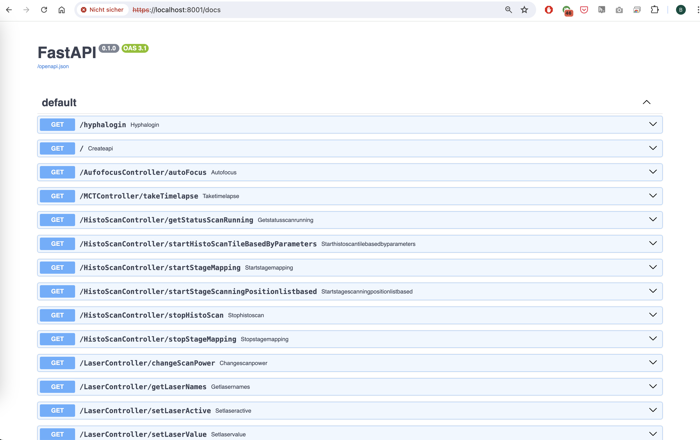
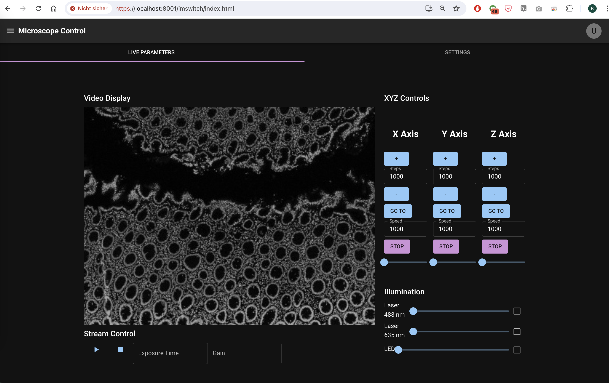
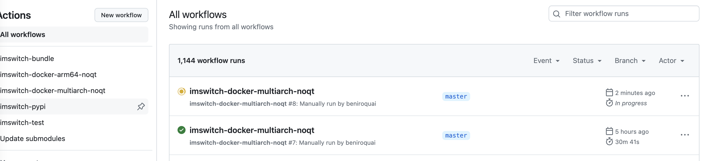
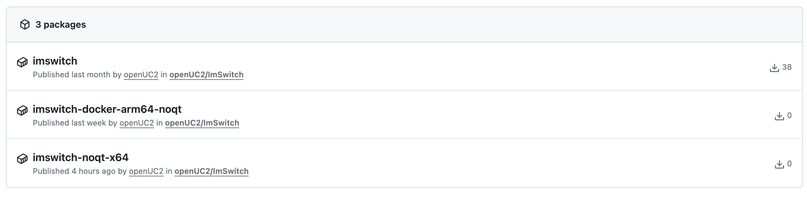

## Setting Up ImSwitch React and Backend (optional: with Docker Compose)

**Warning** This is very experimental. What you can expect:

- This installs an NO-QT (no PyQt/Qt dependency) headless version on your computer
- The APP is exposed under Port 8001 on your localhost
- You can access the Swagger GUI under https://localhost:8001/docs
- You can access the REACT APP (source: https://github.com/openUC2/imswitch-aiortc-react/) under https://localhost:8001/imswitch/index.html
- You can customize the setup config/boot behaviour using additional arguments
- The `dockerfile` can mount HIK cameras (tested on ARM devices)
- The `dockerfile` is available here: https://github.com/openUC2/ImSwitch/blob/master/docker/HIK/dockerfile
- The github actions file that builds the NOQT branch into a docker image for ARM/X86 is available here: https://github.com/openUC2/ImSwitch/blob/master/.github/workflows/imswitch-docker-multiarch-noqt.yaml



*Swagger UI Interface of the ImSwitch Server*


*The React APP is statically hosted using a fastaAPI endpoint under https://localhost:8001/imswitch/index.html (**ENSURE YOU HAVE ACCEPTED THE CERTIFICATE**)*


*The images are build using CI using [actions](https://github.com/openUC2/ImSwitch/blob/master/.github/workflows/imswitch-docker-multiarch-noqt.yaml)


*The docker Images are hosted on [github containers](https://github.com/orgs/openUC2/packages?repo_name=ImSwitch)*

### Prerequisites

- Docker installed on your system (Tested on Raspi, Jetson Nano, Mac M1, Windows)
- Optional: Docker Compose installed on your system

### Docker Quick Start

#### ARM64 + X86

```
sudo docker pull ghcr.io/openuc2/imswitch-noqt-x64:latest
sudo docker run -it --rm -p 8001:8001 -p 2222:22 -e HEADLESS=1 -e HTTP_PORT=8001 -e CONFIG_FILE=example_virtual_microscope.json -e UPDATE_GIT=0 -e UPDATE_CONFIG=0 --privileged ghcr.io/openuc2/imswitch-noqt-x64:latest
```

### Additional Information

This tutorial will guide you through the process of setting up the ImSwitch React frontend and backend using Docker Compose. The ImSwitch React frontend is exposed on port 3000 and provides access to the REST API via a Swagger UI running in another Docker container on `localhost:8001`. The Swagger UI is available at `localhost:8001/docs`. This setup uses a simulated microscope with a line-like sample. The configuration is provided by a JSON file that can be updated if the corresponding flag is set. Additionally, the ImSwitch version can be updated based on a flag. If access to the camera (HIK camera and UC2-REST) is needed, the `--privileged` flag must be set.


### Docker Compose Configuration

Create a `docker-compose.yml` file with the following content or use the file in [compose.yaml](compose.yaml):

```yaml
version: '3.8'

services:
  imswitch-aiortc-react:
    image: ghcr.io/openuc2/imswitch-aiortc-react:latest
    ports:
      - "5000:5000"
      - "8002:8001"
    environment:
      - NODE_ENV=production
    stdin_open: true
    tty: true

  imswitch-docker-arm64-noqt:
    image: ghcr.io/openuc2/imswitch-docker-arm64-noqt:latest
    privileged: true
    ports:
      - "8001:8001"
      - "2222:22"
    environment:
      - HEADLESS=1
      - HTTP_PORT=8001
      - CONFIG_FILE=example_virtual_microscope.json
      - UPDATE_GIT=1
      - UPDATE_CONFIG=0
    stdin_open: true
    tty: true
    restart: always
```

### Explanation

- **imswitch-aiortc-react**: This service runs the ImSwitch React frontend.
  - **image**: Specifies the Docker image to use.
  - **ports**: Maps the container ports to the host ports.
  - **environment**: Sets environment variables inside the container.
  - **stdin_open** and **tty**: Keeps the container running in interactive mode.

- **imswitch-docker-arm64-noqt**: This service runs the backend with the Swagger UI.
  - **image**: Specifies the Docker image to use.
  - **privileged**: Grants the container privileged access to the hardware.
  - **ports**: Maps the container ports to the host ports.
  - **environment**: Sets environment variables inside the container.
  - **stdin_open** and **tty**: Keeps the container running in interactive mode.
  - **restart**: Ensures the container restarts automatically if it stops.

### Running Docker Compose

1. Save the `docker-compose.yml` file to a directory on your machine.
2. Open a terminal and navigate to the directory containing the `docker-compose.yml` file.
3. Start the services with Docker Compose:

```sh
docker-compose -f docker-compose.yml up -d
```

4. go to your browser and access the microscope server under https://localhost:8001/docs to access the swagger uI
5. go to your browser and access the microscope control UI under http://localhost:3000
5.1 enter the IP address and port und `Connections`:  `https://localhost` and `8001` as port

### Accessing the Services individually

- **ImSwitch React Frontend**: Open your browser and navigate to `http://localhost:3000` to access the ImSwitch React frontend.
- **Swagger UI**: Navigate to `http://localhost:8001/docs` to access the Swagger UI for the backend API.

### Configuration Details

- **Simulated Microscope**: The current configuration uses a simulated microscope offering a line-like sample. The configuration is provided by a JSON file specified in the `CONFIG_FILE` environment variable.
- **Updating Configuration and Version**: The JSON configuration and the ImSwitch version can be updated if the `UPDATE_CONFIG` and `UPDATE_GIT` flags are set, respectively.
- **Camera Access**: If access to the camera (HIK camera and UC2-REST) is needed, the `--privileged` flag must be set.

### Stopping the Services

To stop the services, run the following command:

```sh
docker-compose -f docker-compose.yml down
```

This command stops and removes all containers defined in the `docker-compose.yml` file.

### Additional Notes

- Ensure that Docker and Docker Compose are installed and running on your system.
- The `--privileged` flag is necessary for accessing certain hardware components like cameras.

By following this tutorial, you should be able to set up and run the ImSwitch React frontend and backend with Docker Compose, providing a seamless environment for interacting with the simulated microscope and accessing the API via Swagger UI.
