************************
Graphical User Interface
************************
.. image:: ./images/gui.png 

The ImSwitch GUI is divided in different modules in order to make it intuitive to explore
for both users and developers.

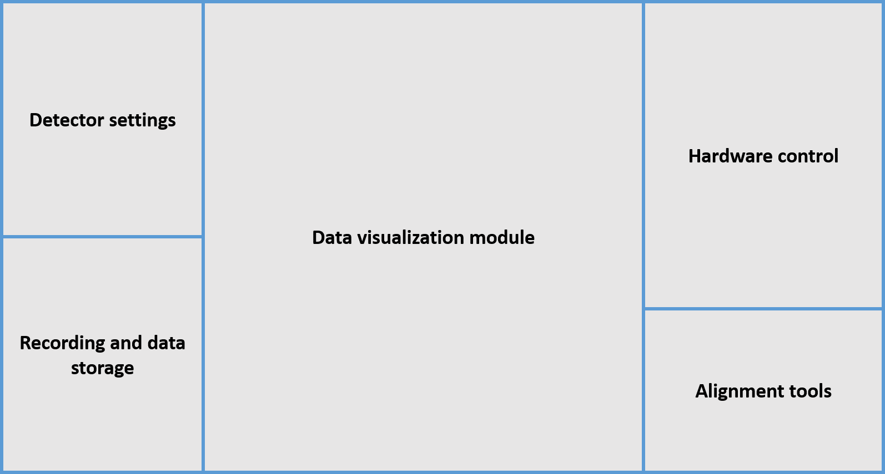

Detector Settings
========================
This section interacts with the different detectors of the system.
These can be either Cameras or Point Detectors.
The user has access to different parameters like the subarray size
(to determine the field-of-view used in a camera) as well as a 
set of ROIs to use (which can be updated in real time by saving the current ROI);
and other properties like the trigger type and exposure time.
The developer can also add more parameters in the specific DetectorManager, 
they will depend on the type of detector selected.

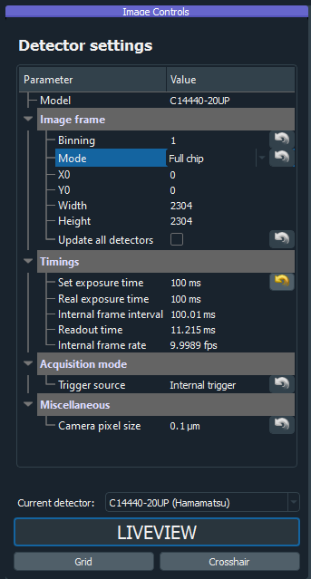

Recording and data storage
===========================
Either during a scan or free running mode, 
the recording section will make sure to retrieve all the incoming 
images from the Detector Managers selected and save them.

The images can be saved in the disk, in RAM to be shared to the Image Processing module, or both.
There are different recording modules depending on the type of recording:

* **Number of frames**: the user specifices the number of frames to be saved.
* **Time (s)**: similar as above but specifying the time instead.
* **Scan once**: the recording will stop once the current scan does.
* **Timelapse**: there will be sequential recordings spaced by the time that the user inputs. Each image from the scan (or raw frames) will be saved in a different file.
* **3D Lapse**: same as timelaps but moving the positioner in between, alternative way to perform a 3D scan.
* **Run until stop**: the recording thread will run until it's stopped by the user.

The data will be saved in hdf5 together with the parameters of ImSwitch (laser power, scan parameters, etc). 

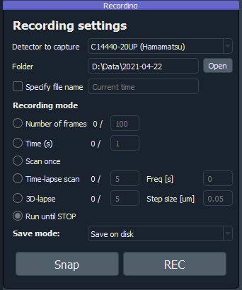

Data visualization module
==========================
We incorporated Napari for visualizing the real-time images from the detectors.
It works with both point detectors and cameras, and Napari offers good support
for displaying multiple channels and possibly one could add plugins as well for data analysis.
This module enables the use of multiple cameras and point detectors simultaneously.

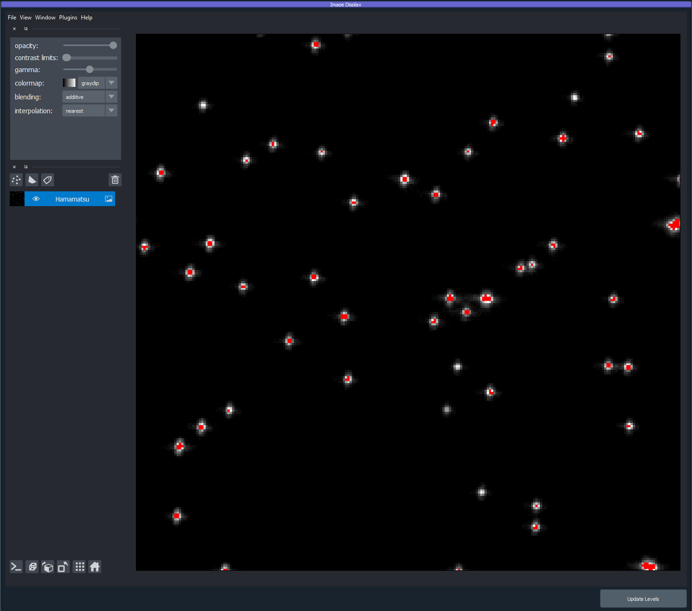

Hardware control
========================
In this section the modules for hardware control are implemented.
The main components are the laser widget, SLM widget, Focus-lock widget, positioner widget, scanning widget.
New modules could be easily added following the main structure of ImSwitch. 
The hardware is automatically loaded from the JSON configuration files.

Laser widget
-------------
There are two different ways we normally use the lasers, *offline* and triggered only by the buttons and sliders
in this widget, or trigered by an acquisition card controlled by the scanning widget, in this last case we press the
*Digital Modulation* button and write down the desired powers during the scan.

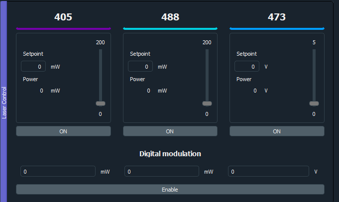

SLM widget
-----------
Focus-lock widget
------------------
Positioner widget
------------------
For positioner we mean any type of scanning device that we wish to move either during a scan
or by using this interface. 
The scripting module will also have access to this functions for automation applications.

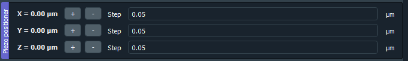

Scanning widget
----------------
This module is designed for systems that need scanning in order to obtain an image.
So far we have only implemented it with a Nidaq, but it could also be generalized to other DAQs. 
In the config file the user specifies the lines to which the instruments are created and the ScanDesigner
and SignalDesigner will create the signals to send. 
Specific modalities can implement their own version of the designers, since they are abstract classes.

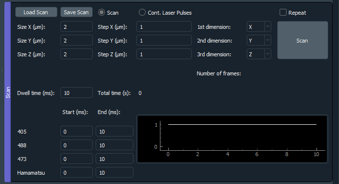

Alignment tools
========================
The Alignment tools are a set of widgets that we use in the lab for aligning the microscope.
They don't control any hardware but instead perform operations on the images that make
it easy for having feedback on the alignment process.
They can be easily hidden or added by listing them in the configuration file, the idea is that
new tools can be implemented in different microscopy modalities, so far these are the ones that we have
implemented for our modalities.

Alignment line
---------------

Displays a line with a certain angle on top of the images.

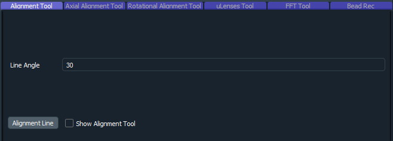

Axial alignment tool
---------------------
The user selects a ROI and this tool will plot the mean value over time. 

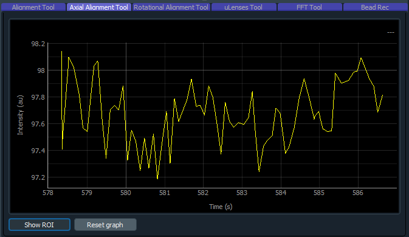

Rotational alignment tool
--------------------------
Similar as before but only over one axis (x or y).

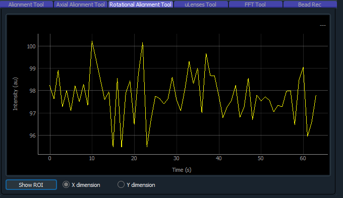

uLenses tool
-------------
Will display an array of points with a certain periodicity in the image.

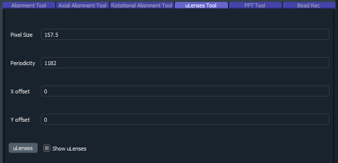

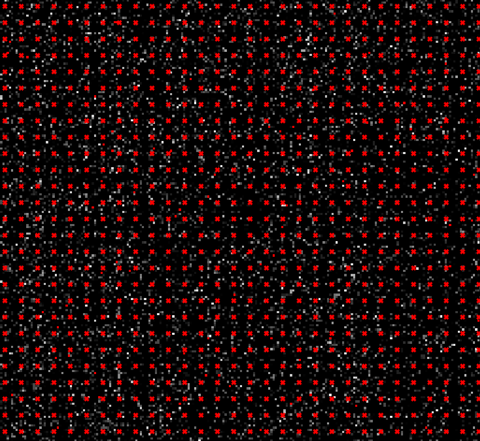

FFT tool
---------
Performs the fourier transform of the incoming images in real time.

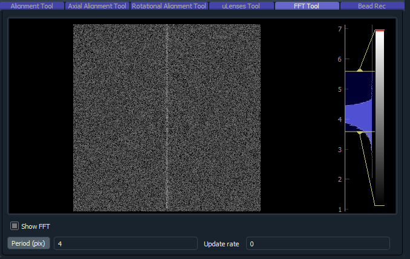

Bead rec tool
---------------
During a scan, this tool will integrate and reconstruct an image given a beadscan.
Each step of the scan represents one pixel.

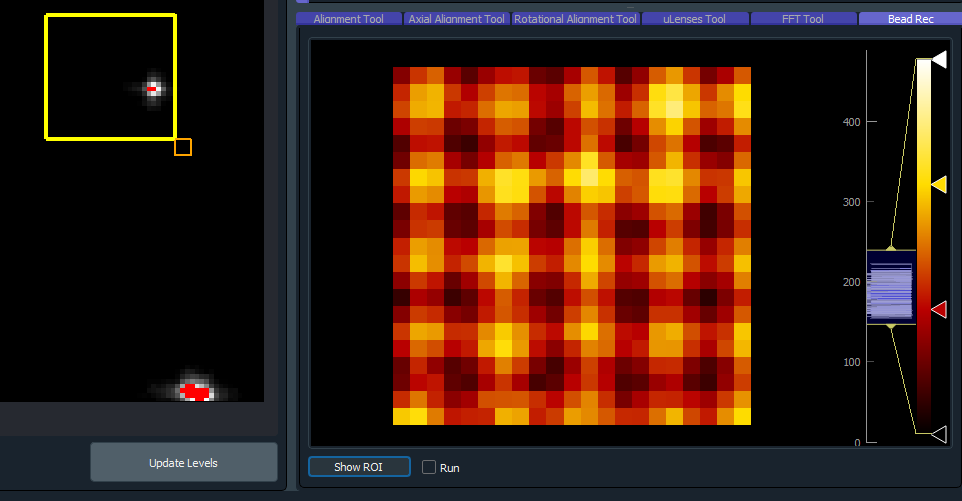
