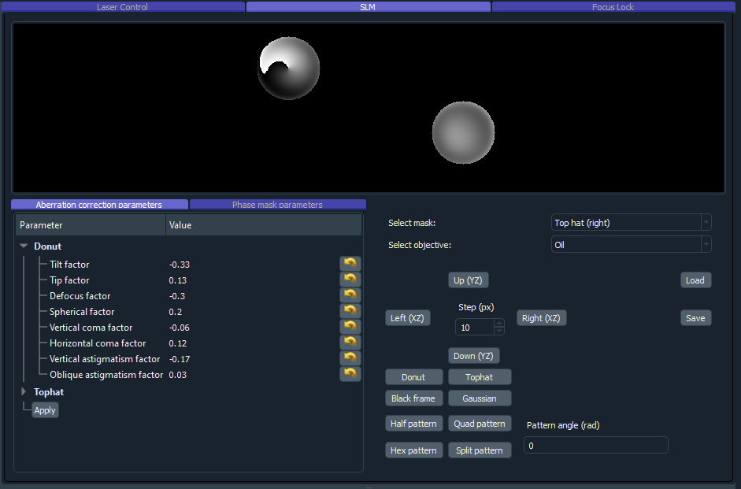
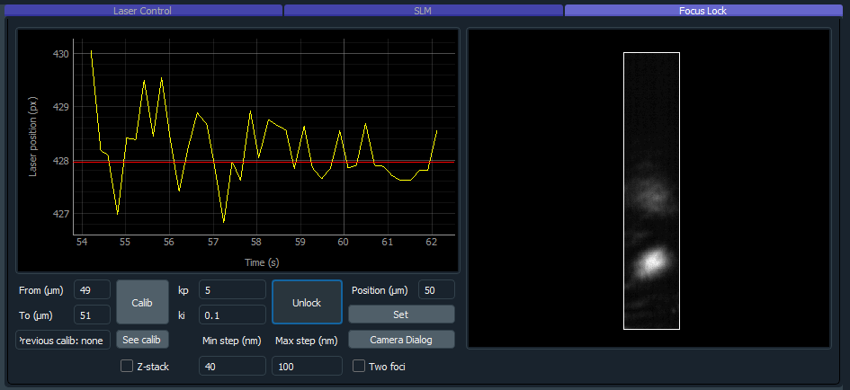

************************
Graphical User Interface
************************
.. image:: ./images/gui.png 

The ImSwitch GUI is divided in different modules in order to make it intuitive to explore
for both users and developers.

.. image:: ./images/gui_skeleton.png

Detector Settings
========================
This section interacts with the different detectors of the system.
These can be either Cameras or Point Detectors.
The user has access to different parameters like the subarray size
(to determine the field-of-view used in a camera), a 
set of ROIs to use (which can be updated in real time by saving the current ROI),
and other properties like the trigger type and exposure time.
The parameters shown will depend on the type of detector selected, and additional parameters
can be added by the developer in the specific DetectorManagers.

.. image:: ./images/detector-widget.png
    :width: 400px
    :align: center

Recording and data storage
===========================
Either during a scan or free running mode, 
the recording section will make sure to retrieve all the incoming 
images from the DetectorManagers selected and save them.

The images can be saved in the disk, in RAM to be shared to the Image Processing module, or both.
There are different recording modules depending on the type of recording:

* **Number of frames**: the user specifices the number of frames to be saved.
* **Time (s)**: similar as above but specifying the time instead.
* **Scan once**: the recording will stop once the current scan does.
* **Timelapse**: there will be sequential recordings spaced by the time that the user inputs. Each image from the scan (or raw frames) will be saved in a different file.
* **3D Lapse**: same as timelaps but moving the positioner in between, alternative way to perform a 3D scan.
* **Run until stop**: the recording thread will run until it's stopped by the user.

The data will be saved in hdf5 together with all user-interactable parameters of ImSwitch (laser power, scan parameters, etc). 

Images can additionally be saved after a scan, using the Snap button. This is the use-case for procedurally-updated images while using for example point-detectors as in confocal or STED imaging. 

.. image:: ./images/recording-widget.png
    :width: 400px
    :align: center

Data visualization module
==========================
We incorporated Napari for visualizing the real-time images from the detectors.
It works with both point detectors and cameras, and Napari offers good support
for displaying multiple channels. Additionally and one could add plugins for data analysis or visualization tools.
This module enables the use of multiple cameras and point detectors simultaneously.
Point detector images are updated on a line-by-line basis during the acquisition. 

.. image:: ./images/data-widget.png
    :width: 400px
    :align: center

Hardware control
========================
In this section the modules for hardware control are implemented.
The main components are the laser widget, scanning widget, positioner widget, focus lock widget, and SLM widget.
Developers can easily add new modules following the main structure of ImSwitch, for controlling additional hardware or controlling differently current hardware. 
The hardware control widgets necessary are automatically loaded depending on the user-defined settings in the JSON configuration files.

Laser widget
-------------
There are two different ways we normally use the lasers, *offline* and triggered only by the buttons and sliders
in this widget, or trigered by an acquisition card controlled by the scanning widget. In the latter case we press the
*Digital Modulation* button and set the desired powers during the scan.

.. image:: ./images/laser-widget.png
    :width: 400px
    :align: center

SLM widget
-----------
In the SLM widget you can control the phase masks which you use to shape the laser line that is incident on it. The SLM widget is configured to control two simultaneous phase masks applied on a beam, such as for shaping a STED laser beam into an overlayed donut and tophat pattern for 3DSTED, but can readily be reprogrammed to deal with other beam shaping for different methods. Through the widget you can control what type of mask you want to show in each of the two sides (donut, tophat, gaussian, half/quad/hex/split patterns for alignment purposes), the position of the masks, and their respective Zernike-polynomial-based aberration correction parameters for correcting stationary aberrations in the setup (implemented are tip/tilt, defocus, spherical, vertical/horizontal coma, and vertical/oblique astigmatism, additional polynomials can be readily implemented). It also has controls for saving/loading all the parameters to/from a pickled file. 

Focus lock widget
------------------
In the focus lock widget you can control a reflection-based focus lock which operates by reflecting a laser beam off the cover slip in total internal reflection and is detected on a camera. Movement of the sample in z corresponds to lateral movement of the laser spot on the camera. The center of the spot is tracked and through a feedback loop (PI controller) commands is sent to the connect z-positioner to move the sample to counter-act the detected movement. The widget has controls for locking/unlocking the sample in the current position, setting the z-position of the connected z-positioner, a setting for handling double reflections from the sample, and settings for the proportional and integral gain of the PI controller.

Positioner widget
------------------
For positioner we mean any type of scanning device that we wish to move either during a scan
or by using this interface. The widget shows the current position of the positioners used in this interface, and has controls for moving them a set step size.
The scripting module will also have access to these functions for automation applications.

.. image:: ./images/positioner-widget.png
    :width: 400px
    :align: center

Scanning widget
----------------
This module is designed for systems that need scanning for acquisition of an image.
We have implemented it to be used with a Nidaq card, but it can also be generalized to other DAQs. 
In the config file the user specifies the analog/digital lines to which the instruments are connected, and the ScanDesigner
and SignalDesigner will create the analog/digital signals to send to them for scanning. 
Specific modalities can implement their own version of the designers, since they are abstract classes.

.. image:: ./images/scanning-widget.png
    :width: 400px
    :align: center

Alignment tools
========================
The Alignment tools are a set of widgets that we use in the lab for aligning the MoNaLISA microscope.
They do not control any hardware but instead perform operations on the images that provide easy feedback on the alignment process.
They can be easily hidden or added by listing them in the configuration file. The general idea is that
new tools can be implemented for different microscopy modalities and added to the library. 

Alignment line
---------------
Displays a line with a certain angle on top of the images.

.. image:: ./images/line-widget.PNG
    :width: 400px
    :align: center

Axial alignment tool
---------------------
The user selects a ROI and this tool will plot the mean value over time. 

.. image:: ./images/axial-widget.PNG
    :width: 400px
    :align: center

Rotational alignment tool
--------------------------
Similar as before but only over one axis (x or y).

.. image:: ./images/rotation-widget.PNG
    :width: 400px
    :align: center

uLenses tool
-------------
Will display an array of points with a certain periodicity in the image.

.. image:: ./images/ulenses-widget.PNG
    :width: 400px
    :align: center

.. image:: ./images/ulensesview-widget.PNG
    :width: 400px
    :align: center

FFT tool
---------
Performs the fourier transform of the incoming images in real time.

.. image:: ./images/fft-widget.PNG
    :width: 400px
    :align: center

Bead rec tool
---------------
During a scan, this tool will integrate and reconstruct an image given a beadscan.
Each step of the scan represents one pixel.

.. image:: ./images/beadrec-widget.PNG
    :width: 400px
    :align: center
