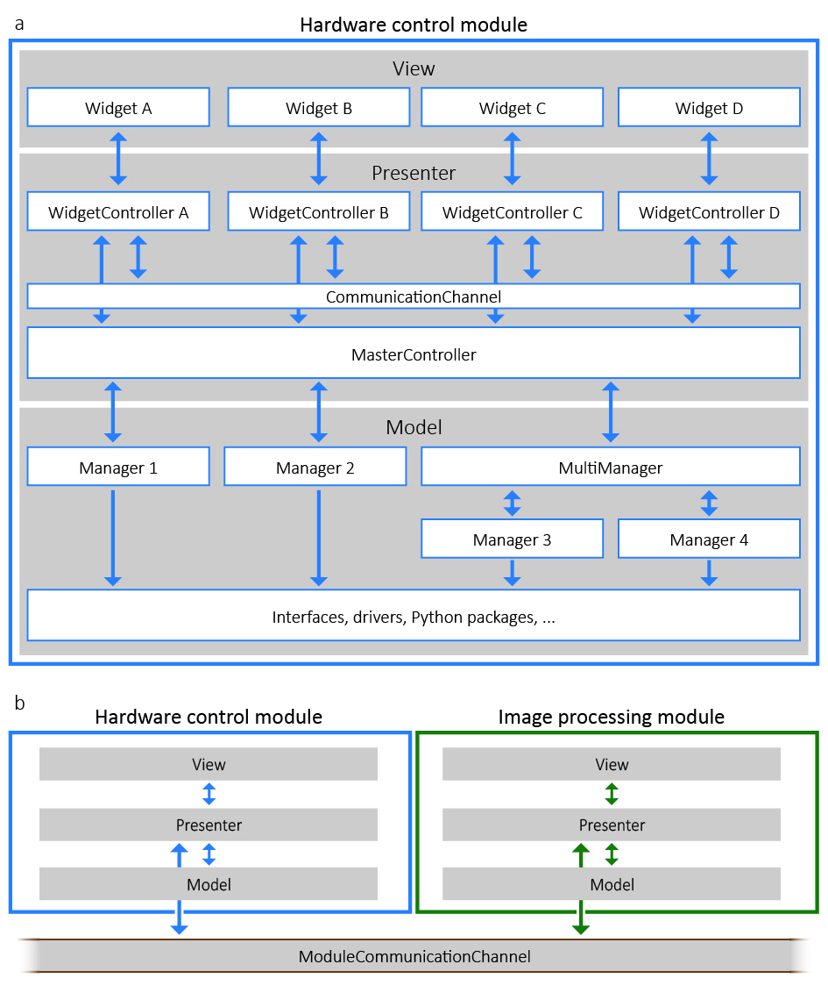

********
ImSwitch
********

``ImSwitch`` is a software solution in Python that aims at generalizing microscope control by using an architecture based on the model-view-presenter (MVP) design pattern and enabling flexible control of multiple microscope modalities.

The constant development of novel microscopy methods with an increased number of dedicated
hardware devices poses significant challenges to software development. 
ImSwitch is designed to be compatible with many different microscope modalities and customizable to the
specific design of individual custom-built microscopes, all while using the same software. We
would like to involve the community in further developing ImSwitch in this direction, believing
that it is possible to integrate current state-of-the-art solutions into one unified software.

* ImSwitch has automated testing in Github, including ui and unit tests. It is also possible to manually inspect and test the software without any device since it contains mockers that are automatically initialized if the instrumentation specified in the config file is not detected.

* It is possible to implement, import and test user-defined scripts in the scripting module. 

In this documentation page you will find all information you need about the installation, usage and development of ImSwitch,
both from the user perspective (GUI description and use cases) as
well as for developers (scripting and API modules, and hardware control and JSON config files).

.. toctree::
    :hidden:
    :caption: Basics

    installation
    gui
    use-cases
    imcontrol-setups
    scripting

.. toctree::
    :glob:
    :hidden:
    :caption: Scripting API reference

    api/*
