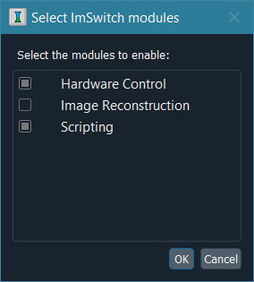

********************
Module Configuration
********************

ImSwitch consists of multiple different modules:

+----------------------+-------------------+
| Name                 | ID                |
+======================+===================+
| Hardware Control     | ``imcontrol``     |
+----------------------+-------------------+
| Image Reconstruction | ``imreconstruct`` |
+----------------------+-------------------+
| Scripting            | ``imscripting``   |
+----------------------+-------------------+

One can select which modules to enable through the "Set active modules…" option in the "Tools" menu
of the menu bar. By default, the hardware control and scripting modules are enabled. Modules that
are not enabled will not show up in the program.

Behind the scenes, the list of enabled modules is defined in the /config/modules.json file, which is
automatically created the first time the program starts.
