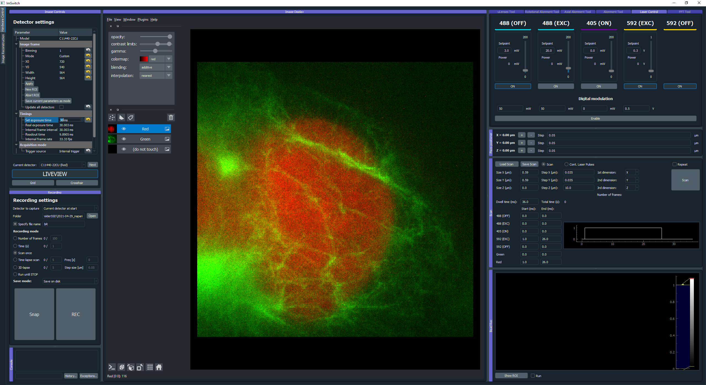

****************
Use Cases
****************
The first time the code is initialized, it will show a dialog to choose the setup to be loaded. 
The user can change the setup option during execution in "Tools" in the main toolbar.

.. image:: ./images/config.png
    :align: center

Parallelized confocal and RESOLFT (MoNaLISA)
---------------------------------------------
Here we explain how we implemented ImSwitch for `MoNaLISA <https://www.nature.com/articles/s41467-018-05799-w>`_. In the article, you will find more information
about the setup and how the data is reconstructed.

Configuration file and hardware specifications
^^^^^^^^^^^^^^^^^^^^^^^^^^^^^^^^^^^^^^^^^^^^^^^
For this microscope use case, we created the JSON file ``monalisa.json``, located at ``imswitch/config/imcontrol_setups/monalisa.json``

We chose a National Instruments Data Acquisition (NIDAQ) card for managing the synchronization of the devices.

In the JSON file, two cameras are specified for two-color imaging: Green and Red.
Both cameras are Hamamatsu, so they use ``HamamatsuManager``. All the required camera properties are defined there,
like the DAQ digital line for external triggering, readout speed, exposure time, field of view, etc.

There are five lasers in this setup, we use acousto-optic modulators (AOM) connected to the DAQ to control some of them,
and others need the vendor interface as well, in this case Cobolt. The specific manager is defined for each type, ``LantzLaserManager`` or ``NidaqAOLaserManager``, (see Hardware Control Configuration). 

We use a X-Y-Z stage that we control through the DAQ as well, so the axes are defined as positioners using ``NidaqAOPositionerManager``. The analog lines and conversion factors are specified as well.
The modules that will create the signals for the scan are ``BetaStageScanDesigner`` for the Stage, and ``BetaTTLCycleDesigner`` for the instrument synchronization.

Other config parameters related to scanning, regions of interest (ROI) and a list of widgets to be loaded are added in this file. 

Hardware control module
^^^^^^^^^^^^^^^^^^^^^^^^
This module is useful to control the hardware and screen the sample using widefield or our other patterns. We have provided a more detailed explanation of the 
GUI :doc:`here <gui>`. To record a super-resolution image the user sets the camera to external-trigger mode and inserts the scan pulse scheme.
The scanning module synchronizes the different instruments through the DAQ, and the raw data is displayed in the liveview.

The user can choose to save the raw data either in disk (hdf5) or RAM (or both) using the Recorder widget. 
So, for example, we program our scan and then click "Scan Once" in REC to start our acquisition. 
The metadata is also saved in the hdf5 and can be reloaded from the toolbar.
It contains all the scanning pulses and hardware parameters related to the experiment.

* GUI while using two-color widefield:

Image processing module for image reconstruction
^^^^^^^^^^^^^^^^^^^^^^^^^^^^^^^^^^^^^^^^^^^^^^^^^^
The raw data can be either manually loaded into the reconstruction module or automatically retreived from the scanning if selected in the Recording widget. The user can further analyze the data using Napari image viewer.
In this module we use our custom-designed DLLs for reconstruction, since this is a rather specific type of algorithm for our method. But the idea is that different microscope techniques implement their own modules as well.
"Multidata management" stacks all the data incomming from the hardware control module.

* The Image processing module is illustrated in the following image:

.. image:: ./images/reconstruction.png
    :width: 600px
    :align: center

Point-scanning confocal and STED 
----------------------------------