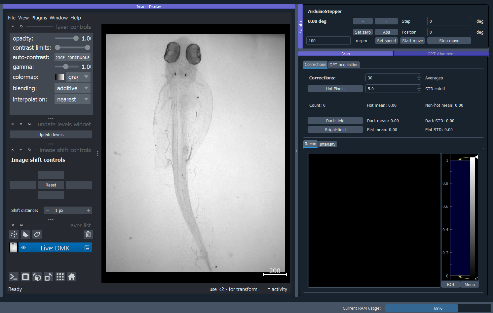
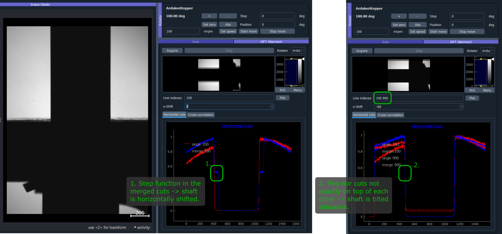
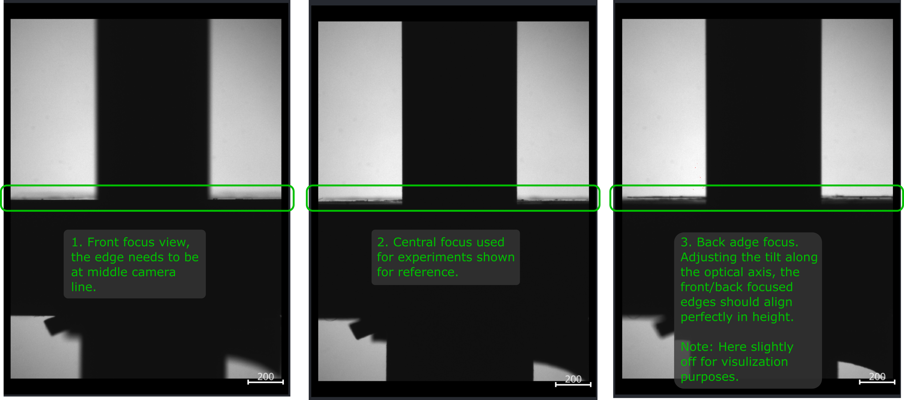
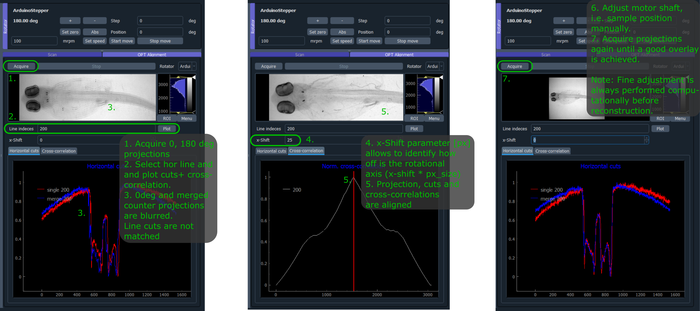
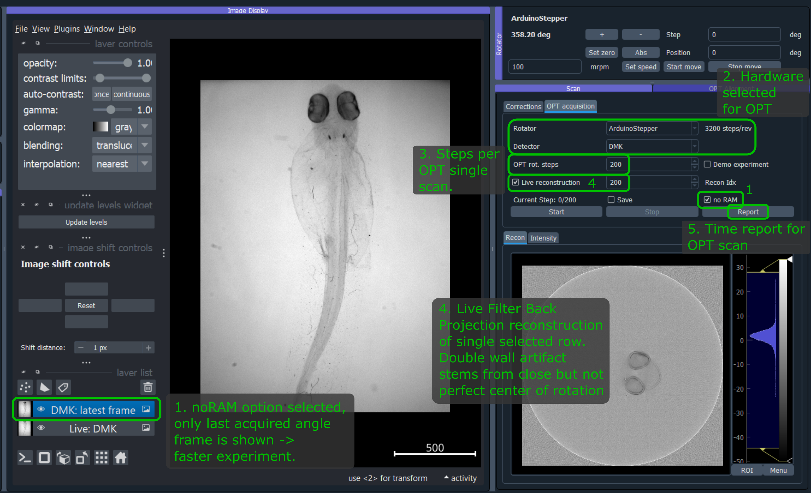
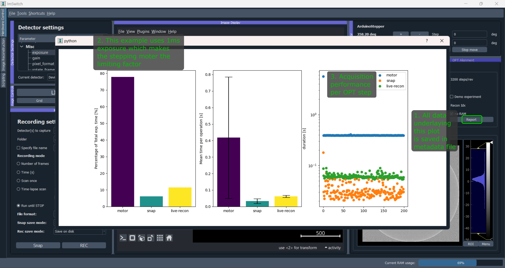

*********
Use cases
*********

The first time the hardware control module is initialized,
it will show a dialog to choose the hardware setup to be loaded.
The user can change the setup option during execution in "Tools" -> "Pick hardware setup…" in the hardware control module's menu bar.

.. image:: ./images/config.png
    :align: center

Parallelized confocal and RESOLFT (MoNaLISA)
---------------------------------------------
Here we explain how we implemented ImSwitch for `MoNaLISA <https://www.nature.com/articles/s41467-018-05799-w>`_. In the article, you will find more information
about the setup and how the data is reconstructed.

Configuration file and MoNaLISA hardware specifications
^^^^^^^^^^^^^^^^^^^^^^^^^^^^^^^^^^^^^^^^^^^^^^^^^^^^^^^^^^^^^^^^^^
For this microscope use case, we created the JSON file ``example_monalisa.json``, located at ``/imswitch/_data/user_defaults/imcontrol_setups/example_monalisa.json``

We chose a National Instruments Data Acquisition (NIDAQ) card for managing the synchronization of the devices.

In the JSON file, two cameras are specified for two-color imaging: Green and Red.
Both cameras are Hamamatsu, so they use ``HamamatsuManager``. All the required camera properties are defined there,
like the DAQ digital line for external triggering, readout speed, exposure time, field of view, etc.

There are five lasers in this setup, we use acousto-optic modulators (AOM) connected to the DAQ to control some of them,
and others need the vendor interface as well, in this case Cobolt. The specific manager is defined for each type, ``LantzLaserManager`` or ``NidaqLaserManager``, (see Hardware Control Configuration).

We use a X-Y-Z stage that we control through the DAQ as well, so the axes are defined as positioners using ``NidaqPositionerManager``. The analog lines and conversion factors are specified as well.
The modules that will create the signals for the scan are ``BetaStageScanDesigner`` for the Stage, and ``BetaTTLCycleDesigner`` for the instrument synchronization.

Other config parameters related to scanning, regions of interest (ROI) and a list of widgets to be loaded are added in this file. 

Hardware control module
^^^^^^^^^^^^^^^^^^^^^^^^
This module is useful to control the hardware and screen the sample using widefield or our other patterns. We have provided a more detailed explanation of the 
GUI :doc:`here <gui>`. To record a super-resolution image the user sets the camera to external-trigger mode and inserts the scan pulse scheme.
The scanning module synchronizes the different instruments through the DAQ, and the raw data is displayed in the liveview.

The user can choose to save the raw data either in disk (hdf5) or RAM (or both) using the Recorder widget. 
So, for example, we program our scan and then click "Scan Once" in REC to start our acquisition. 
The metadata is also saved in the hdf5 and can be reloaded from the toolbar.
It contains all the scanning pulses and hardware parameters related to the experiment.

* GUI while using two-color widefield:

.. image:: ./images/gui.png
    :width: 600px
    :align: center

Image processing module for image reconstruction
^^^^^^^^^^^^^^^^^^^^^^^^^^^^^^^^^^^^^^^^^^^^^^^^^^
The raw data can be either manually loaded into the reconstruction module or automatically retrieved from the scanning if selected in the Recording widget. The user can further analyze the data using Napari image viewer.
In this module we use our custom-designed DLLs for reconstruction, since this is a rather specific type of algorithm for our method. But the idea is that different microscope techniques implement their own modules as well.
"Multidata management" stacks all the data incoming from the hardware control module.

* The Image processing module is illustrated in the following image:

.. image:: ./images/reconstruction.png
    :width: 600px
    :align: center

Point-scanning confocal and STED 
----------------------------------
Here we explain how we implemented ImSwitch for a `custom-built STED setup <https://doi.org/10.1088/1361-6463/ab4c13>`_ in the lab, previously controlled by a combination of closed-source software (image acquisition) and purpose-built software (hardware control). In the article, you will find more information about the setup, what hardware it contains, and the type of image acquisition we want to perform.

Configuration file and STED hardware specifications
^^^^^^^^^^^^^^^^^^^^^^^^^^^^^^^^^^^^^^^^^^^^^^^^^^^^^^^^^^^^^^^^^^^^^^^^
For this microscope use case, we created the JSON file ``example_sted.json``, located at ``/imswitch/_data/user_defaults/imcontrol_setups/example_sted.json``

We chose a National Instruments Data Acquisition (NIDAQ) card for managing the synchronization of the devices and image acquisition.

In the JSON file, two photon-counting point detectors (APD) are specified for two-color imaging: APDGreen and APDRed.
These do not need any specific hardware control, but instead are read entirely through the Nidaq. 
Additionally two cameras are specified: one for widefield, for having an overview of the sample, and one for the focus lock, as described in detail in the cited article. 
Both cameras are The Imaging Source cameras, so they use ``TISManager``. All the required camera properties are defined, like the camera index in the list of cameras, exposure, gain, brightness, and chip size in pixels.

There are three lasers in this setup, and all three have an associated AOM or AOTF to rapidly control the power, and hence there are six laser devices defined. Two of them controls only fast digital modulation through digital Nidaq lines (561 and 640 lasers); one controls fast digital modulation and analog modulation through digital and analog Nidaq lines (775AOM); one controls the 775 nm laser through RS232 communication and hence has an associated rs232device (775Katana); and the last two controls the power modulation of the multiple channels of the common AOTF for the 561 and 640 nm lasers through RS232 communication with an associated rs232device (561AOTF and 640AOTF). The speicfic manager is defined for each device, ``NidaqLaserManager``, ``AAAOTFLaserManager``, or ``KatanaLaserManager``.

We use galvanometric mirrors for the XY-scanning that we control through the DAQ, so the axes are defined as positioners using ``NidaqPositionerManager``. The analog lines of the Nidaq used and conversion factors, for converting µm of the user-input to V for the signal, are specified as well. Additionally a piezo is used for Z-movement, controlled both through analog signals from the DAQ with a ``NidaqPositionerManager`` and through RS232 communication with a ``PiezoconceptZManager``. 

The modules that will create the signals for the scan are ``GalvoScanDesigner`` for the XY-scanning, and ``PointScanTTLCycleDesigner`` for the laser synchronization. The analog scan designer will create smooth scanning signals with linear acquisition regions for good control of the galvanometric mirrors. The TTL designer will create laser modulation signals that can be controlled on a sub-line level with the widget interface, with automatic turn off during the portions of the scan that are not during acquisition. 

The Hamamatsu SLM used in the setup is managed through the ``SLMManager``, and is simply controlled by connecting it as a monitor and showing a gray-scale image with the pixel values corresponding to the phase-shift you want to impose. The manager is responsible for building this image based on the user-input from the widget. 

The focus lock does not have a separate manager, but instead is associated with one of the TIS cameras and the Z-piezo rs232device. The properties for the focus lock specifies what hardware devices it should associate with, what part of the camera frame should be cropped, and the update frequency (in Hz) of the PI control loop.

The RS232 communication channel protocol parameters necessary for the control of the hardware devices requiring so are also defined in the same file.

Other config parameters and a list of widgets to be loaded are added in this file as well. 

Main module
^^^^^^^^^^^^
The main, and only, module for this use case is used to control all the hardware, screen the sample with widefield, acquiring the images, and inspecting them with the visualization tools. We have provided a more detailed explanation of the GUI :doc:`here <gui>`. To record a confocal image, the user sets the scan parameters that they want for each scan axis (length, pixel size, center position), the pixel dwell time, sets the laser powers they want to use, set the TTL start to 0 and end to 1 (units is lines) for the excitation laser they want to use, and runs the scan. The view of the detectors not in use can be hidden in the visualization tool. The scanning module will build the scanning curves, laser modulation curves, create those tasks in the Nidaq, and start them. The raw data is displayed in the liveview, where the image is updated line-by-line during the acquisition. For recording a STED image the procedure is much the same, with the addition that the use turns on the STED laser in the laser module, and sets the corresponding TTL start and end to the same values, and runs the scan. Before this the SLM has to be configured in order to create a desired depletion pattern, where for using a donut and tophat there are helpful tools in the SLM module to align the mask and the aberration correction that will be specific to each setup.

Previous to any image acquisition, while using either a repeating fast confocal scan or a widefield image, the sample has to be set in focus, and the focus lock can then be used to lock the sample in the focal plane. The focus lock acts independent from the image acquisition and can be continuously turned on for as long as wanted.

The user can choose to save the acquired image to a desired folder and with a desired name by using the Snap button in the recording widget. It will be saved in hdf5 format, and will include all user-defined parameters from the GUI as metadata. Functionality to reload metadata parameters from a previously saved hdf5 file can be found in the toolbar, for easy and precise recreation of a previous experiment. Previously recorded images in tiff format can also be loaded in the visualization module in order to be directly compared with the last recorded image or each other. 

* GUI after having acquired a confocal and a STED image:

.. image:: ./images/sted-confocal-usecase.png
    :width: 600px
    :align: center

CoolLED control through USB and TTLs using a NIDAQ
----------------------------------------------------

.. image:: ./images/coolLED_GUI.png
    :width: 600px
    :align: center

We got a CoolLED (https://www.coolled.com/) in the lab and decided to try ImSwitch out in a setting where we want to control the 8 lasers of the device,
both by doing it manually using the sliders and buttons (using a USB port and RS232 communication protocol), but also being able to design and perform a sequence of TTLs and a X-Y-Z Stage controlled by a National Instruments card. This use case could be combined with the Napari viewer and a camera,
or a point scanning system, or any of the other widgets explained in the other Use Cases.

All the lasers are listed in the JSON file ``example_coolLED.json``, located at ``/imswitch/_data/user_defaults/imcontrol_setups/example_coolLED.json``, by specifying:

* Digital line of each laser in the NIDAQ.
* Wavelength and range (0 to 100).
* Channel name (A-H), each corresponding to the laser.

The ``Positioners`` define the stage axis with the settings, such as:

* Analog channel of the NIDAQ.
* Conversion factors.
* Min and Max voltages.
* Axis (X, Y, or Z).

Then, the ``CoolLEDLaserManager`` will communicate with the ``RS232Manager`` for sending the intensity and on/off commands. The parameters of the ``RS232Manager`` are the typical ones
of a RS232 connection, such as:

* Port (Usually COMx).
* Encoding (ascii).
* Baudrate (57600).
* ByteSize (8)
* Parity (None)
* Stop bits (1)

The pulses will be directly handled by the National Instruments card and our TTLDesigner.

Optical Projection Tomography (OPT) using rotator stepping
--------------------------------------------------------------------
contact: `David Palecek (CCMAR, Portugal) <mailto:david@stanka.de>`_, `Teresa Correia (CCMAR, Portugal) <mailto:tmcorreia@ualg.pt>`_

    OPT in imswitch in action using `example_OPTFull4Wire.json` configuration file.

Optical Projection Tomography (OPT) is an optical analogue of X-ray computer tomography used
in medical imaging. OPT can be performed leveraging any microscopy contrast, most widespread
used ones are transmission, fluorescence or polarization. ImSwitch implementation aims to provide
user-friendly access to end-to-end pipeline for the OPT, which consist of these indispensible steps:

#. Hardware control and data acquisition
#. Data preprocessing
#. Tomography volume reconstruction (CPU and GPU, FBP and Deep Learning)

All of them can be performed within ImSwitch, since step 2. and 3. are implemented as napari plugins.

Hardware control
^^^^^^^^^^^^^^^^^^^^^^^^
The setup consists of collimated light-source, diffuser, sample mounted on a rotational stage,
in the refractive index matched medium and infinity corrected objective imaging the
2D projections onto the CMOS camera. All elements are aligned on the camera optical axis.

Configuration file and OPT hardware specifications
~~~~~~~~~~~~~~~~~~~~~~~~~~~~~~~~~~~~~~~~~~~~~~~~~~~~
For this microscope use case, we created the JSON file ``example_OPTFull4Wire.json``, 
located at ``/imswitch/_data/user_defaults/imcontrol_setups/example_OPTFull4Wire.json``.

In the JSON file, one detector is specified for the imaging: DMK 37BUX252 is controlled by ``TIS4Manager`` set for
gray-scale 12bit frame acquisition. The exposure time is defined in `us` for ``TIS4Manager``, however
many other managers might use `ms`.

The rotational stage is controlled via ``TelemetrixRotatorManager``, which controls the Arduino board.
Configure your pin connections via ``piConfig`` in the configuration file. The number of steps per revolution of the
motor is set by ``stepsPerTurn`` parameter.

Scan widget type is set to ``OPT`` and the rest of the parameters are not important. ``optInfo`` serves the purpose of
specifying hardware, which is to be used for OPT, in case many cameras and rotators are connected.

Camera control
~~~~~~~~~~~~~~~~
Camera is software-triggered in the snapping mode. The exposure time is set in the settings
widget on the left. 

`Technical note`: Wait constant before image snap is set equal to exposure time in order to avoid blurring of
images for long exposure times, since snap retrieves last frame in the queue, therefore the request
is delayed by the `waitConst` attribute value. It can be changed only in the source code at the moment in ``ScanOPTWorker``
class.

Rotational stage control
~~~~~~~~~~~~~~~~~~~~~~~~~~~~
The rotational stage is a stepper motor, which can be 2 phase or 4 phase. The number of steps per
revolution needs to be provided in the json configuration file. The motor is controlled by the
`Big Easy Driver <https://www.sparkfun.com/products/12859>`_ and Arduino.
Library used was `telemetrix <https://mryslab.github.io/telemetrix/>`_, which is python interface
based on accellStepper library.

Great resources for the Arduino stepper motor control and wiring can be found for example here:

* `28BYJ-48 Stepper Motor <https://lastminuteengineers.com/28byj48-stepper-motor-arduino-tutorial/>`_.
* `NEMA 17 motors <https://howtomechatronics.com/tutorials/arduino/stepper-motors-and-arduino-the-ultimate-guide/>`_.

Tested HW
~~~~~~~~~~~~~~~~~~~~~~~~~~~~
Cameras:

* `TIS DMK 37BUX252` (USB industrial grade camera, ``TISManager``, ``TIS4Manager``), ``TISManager`` uses older ic3.5 API, while ``TIS4Manager`` implements the newest ic4 API (`Programmer's guide <https://www.theimagingsource.com/en-us/documentation/ic4python/programmers-guide.html>`_), which should support most of the `TIS cameras <https://www.theimagingsource.com/en-us/product/software/icimagingcontrol/>`_.

Rotational stages:

* `Simple stepper 28BYJ-48 <https://lastminuteengineers.com/28byj48-stepper-motor-arduino-tutorial/>`_ (comes with Arduino UNO, ``TelemetrixRotatorManager``), 2048 steps (beware, the gears might be `off <https://forum.arduino.cc/t/28byj-48-steps-per-revolution/876716>`_). It has a magnetic shaft, which is convenient for sample mounting, however the motor is quite useless for OPT due to the low precision and shaft crookedness.
* `Nanotec ST4118M1804-L <https://en.nanotec.com/products/1271-st4118m1804-a>`_ (4 phase stepper motor, ``TelemetrixRotatorManager``), 3200 steps, good quality, backlash free, but requires a driver, we used `BigEasy <https://www.sparkfun.com/products/12859>`_ driver.

Please help us improve and open issues or ask help to implement your own hardware. Or report to us successful
implementations of your hardware to share it here.

Alignment widget
^^^^^^^^^^^^^^^^^^^^^^^^
Rotational axis of the motor shaft as well as the sample needs to be as close to perpendicular to the
optical axis as possible, while also aligned on the central column of the camera chip.
Even though the center of rotation (COR) is always corrected for in the reconstruction step, for depth of field
and resolution reasons it is highly beneficial to have the sample as close to the center of the camera as possible.
Therefore we provide an alignment widget to help with all these tasks. 

The alignment procedure starts with acquisition of tow pairs of counter-projections, ie. 0-180 degrees and 90-270 degrees.
With prefect alignment, each pair is essentially a mirror images to each other. Property which we take
advantage of in the following alignment steps:

#. Flip one of counter-projections and overlay horizontal cuts for user selected camera line.
#. Use shift in x-direction to align the two images, the metric can be visual inspection, cross-correlation or mean central index calculated using thresholding of the cuts with the threshold parameter.
#. The misalignment from the central camera pixel can be calculated as `pixel_size * x_shift`, where `pixel_size` is the camera pixel size in micrometers.
#. Move the motor shaft horizontally and repeat the acquisition until the two images are perfectly aligned.
#. Only one pair of the counter-projections is needed to align the motor shaft.

At this point, the motor shaft is aligned in respect to the camera chip. The next objective is to align
the sample in respect to the motor shaft. Although the mean pixels for the counter-projections coincide,
they most probably do not coincide with the center pixel of the camera. Therefore, the sample needs to be
aligned in respect to the motor shaft.

#. Acquire the counter-projections of the sample.
#. Move sample in `X` and `Y` direction in respect to the shaft iteratively until the the center pixels of **both** counter-projection pairs are as close to the center camera pixel value as possible.

This effectively leads to centering the sample in the center of the reconstructed volume, which leads to
optimization of the steps for obtaining fully sample OPT dataset.
Use the `threshold` (in percents of the maximum intensity counts) parameter to calculate
mean position of the sample and the background camera counts are under the threshold.

Full Example
~~~~~~~~~~~~~~~~~~~~~~~~~~~~
First align the shaft in respect to the camera field of view without the sample:

    OPT alignment widget with the shaft alignment in progress.

#. Make the shaft span vertically most of the camera chip.
#. Acquire the 0 and 180 degree projections by pressing ``Acquire`` button in the ``OPT Alignment`` widget.
#. Select a row Plot the slices, if you see a step function in the `merge`, the shaft is off the chip center.
#. The x-shift allows to shift one of the image in the horizontal direction, which is useful for getting an idea how far from the center you currently are. x-shift is in pixels so once you find the best overlay, you are `x-shift * pixel_size` away from the vertical axis of the chip.
#. Adjust (and re-acquire) the motor shaft horizontal position until the images/slices are perfectly aligned.

#. For the tilt correction, the motor mounted on `Kinematic Platform Base <https://www.thorlabs.com/thorproduct.cfm?partnumber=KM200B/M>`_, which allows for independent alignment of a shaft tilt along the optical axis and perpendicularly to it.
#. For sideways tilt, select two H-cuts, which are close to the bottom and top of your camera field of view.
#. Since the shaft is already centered, the H-cuts show single step function. However, if they are not perfectly on top of each other, the shaft is tilted sideways. Adjust the tilr, and re-acquire until match is achieved.

    Shaft alignment in respect to tile along the optical axis.

#. You can approximately check the tilt along the optical axis too. Attach a `rigid flange <https://www.amazon.com/Rigid-Flange-Coupling-Coupler-Connector/dp/B06Y6MSYCS?th=1>`_ to the motor shaft.
#. Adjust the height of the flange so that the top edge is close to the central line of the camera.
#. Change focusing to the front and back edge of the flange.
#. If the shaft is tilted away from the camera, the flange further from the camera will be clearly visible in the image.
#. On the other hand, if the shaft is tilted towards the camera, the far-away flange will never be visible.
#. Adjust the tilt, that the close and far edge of the flange are aligned in height, and perfectly shadowing each other.

Now the motor is perfectly align, however after mounting the sample, the sample needs to be
centered in respect to both the motor shaft in an analogous procedure as described above.

    Sample alignment in respect to the motor shaft and the camera chip.

OPT acquisition
^^^^^^^^^^^^^^^^^^^^^^^^
Supposing the motor shaft is aligned in respect to the camera chip, align the mounted sample in respect to
the motor shaft in an analogous way as described above. After the alignment, the acquisition itself is trivial.
Define number
of OPT steps you want to acquire. `Note:` If the number of steps does not divide the number of motor steps per revolution without
remainder, confirmation will be requested whether to proceed with the acquisition. If yes, you introduce certain rounding error
casting the requested steps (real numbers) to the ones of the motor (integer numbers). Ee have not tested experimentally, how big
of an effect this has on the resulting reconstruction.

For live reconstruction, define the row index, which will be reconstructed in real time. If the index
is out of range, central row of the camera will be reconstructed.

    
    OTP acquisition widget with live reconstruction in progress.

Select whether to save the data (to the ``recordings`` folder), the folder name is a `datetime` string.
By default all projections will be also kept in RAM for postprocessing and napari viewer will display all
acquired projections so far in a 3D stack. This can be disabled by checking the ``noRAM`` option, which
results in faster acquisition, but only last projection will be displayed in the viewer during the OPT
acquisition.

At this time, only `tiff`` format is supported for saving the data. Metadata are saved in ``metadata.json`` for every
OPT acquisition scan. The metadata contains all the information about the acquisition, as well as hardware settings, with
the exception of optics/sample description. Metadata file is saved in the same folder as the images in the recordings folder.

OPT experiment begins after pressing ``Start`` button.

You can check the time per acquisition operation in the report, looking similar to the one below, which is also saved
in the metadata file.

    Acquisition time tracking report.

Corrections
~~~~~~~~~~~~~~~~~~~~~~~~~~~~
Correction are saved always in the ``recordings/corrections/`` folder.
All corrections are subjected to averaging set by the ``Averages`` parameter.

The hot pixel correction can be used to identify both hot pixels (relevant for fluorescence acquisitions with
long exposures), as well as dead pixels (relevant for bright-field acquisitions with short exposures). For hot
pixel correction, use as long exposure as possible, to make the hot pixels visible. The STD cutoff is used just
to provide illustrative information on how many hot pixels are detected. None of that information is saved or is binding

Dark-field correction is used to correct for the background light, which is detected even without
any light source. To facilitate subtraction, the dark-field acquisition should have the same exposure time as the
acquisition of the experiment.

Bright-field correction is used to correct for the uneven illumination of the field of, i.e. sample. In principle it is relevant
mostly for transmission measurements, however, reflection/scatter of the excitation and leakage through the 
emission filter or very low emissive sample might result in need of bright-field correction for the 
fluorescence too (should be avoided however, because the major reflector
and scatter is the sample itself, and therefore precise bright-field is difficult to get). The bright-field acquisition
should have the same exposure time as the acquisition of the experiment.

Intensity correction for fluctuating light source intensity is applied separately in the preprocessing widget
and essentially tracks intensity of corners of the camera along the volume acquisition.

Practical notes
~~~~~~~~~~~~~~~~~~~~~~~~~~~~
* For short exposure times on the order of 10s of ms, the motor stepping is the limiting factor in the speed of the acquisition. For longer exposure times, necessary for fluorescence imaging, the camera snap time will dominate the scan time. 
* If you want to acquire same datasets at different conditions, do not set zero on the rotator, and do NOT run the continuous rotation. Both will result in losing your rotator 0 posision.
* Use preferably the ``noRAM`` option, because it speeds up the acquisition, as the time to update the viewer with the 3D volume is linearly increasing (O(n)) and can be significant for big volumes.

Demo experiment
~~~~~~~~~~~~~~~~~~~~~~~~~~~~
Even without a hardware, OPT widget allows to simulate and experiment on the Shepp-Logan
phantom. Check the ``demo`` checkbox and the widget will simulate the acquisition of the phantom.
Phantom size is defined by ``opt steps`` parameter, and the full Phantom volume will be sized as
`opt steps` x `opt steps` x `opt steps`. The big cubes might take some time to generate. 
If the rotator is connected, it will move in correct steps.
Live reconstruction is also available, which will show the reconstructed slice progress in real time.

Napari OPT preprocessing module (`OPT handler <https://www.napari-hub.org/plugins/napari-opt-handler>`_)
^^^^^^^^^^^^^^^^^^^^^^^^^^^^^^^^^^^^^^^^^^^^^^^^^^^^^^^^^^^^^^^^^^^^^^^^^^^^^^^^^^^^^^^^^^^^^^^^^^^^^^^^
Download  `OPT preprocessing`  napari plugin from `napari-hub <https://www.napari-hub.org/plugins/napari-opt-handler>`_ 
or `PyPI <https://pypi.org/project/napari-opt-handler/>`_. This plugin allows you to pre-process the OPT data
before final reconstruction step. So far it provides following functionalities which are documented in detail
in the plugin documentation:

* Dark-field correction
* Bright-field correction
* Bad pixel correction
* Intensity correction
* Fluorescence Bleaching correction
* ROI selection
* Binning
* log transformation (for transmission or visualization purposes)

In case you `did not` select ``noRam`` acquisition, the plugin is designed to process the 
acquired OPT stack with the corrections which are either in separate layers, or can be loaded separately.

Please open feature requests or issues on the plugin `github page <https://github.com/QBioImaging/napari-opt-handler/issues>`_.

Napari deep learning reconstruction (`ToMoDL <https://www.napari-hub.org/plugins/napari-tomodl>`_)
^^^^^^^^^^^^^^^^^^^^^^^^^^^^^^^^^^^^^^^^^^^^^^^^^^^^^^^^^^^^^^^^^^^^^^^^^^^^^^^^^^^^^^^^^^^^^^^^^^^^^^^^^^^
contact: `Marcos Obando <mailto: Marcos.Obando@cwi.nl>`_, `Teresa Correia (CCMAR, Portugal) <mailto:tmcorreia@ualg.pt>`_

For the reconstruction of the OPT data, we provide a deep learning reconstruction plugin for Napari, which
includes also standard Filter Back Projection (FBP) reconstruction. The plugin is available at
`napari-hub <https://www.napari-hub.org/plugins/napari-tomodl>`_. The plugin preprocessing steps
partially overlap with the OPT preprocessing plugin, but the reconstruction reconstruction is the
main focus of this plugin. Please open issues or feature requests on the `ToMoDL github repo <https://github.com/obandomarcos/ToMoDL>`_.

* COR axis alignment
* Volume reshaping (binning)
* Removing circular edge from the acquisition
* filtering
* Reconstruction method (with and without GPU support)
