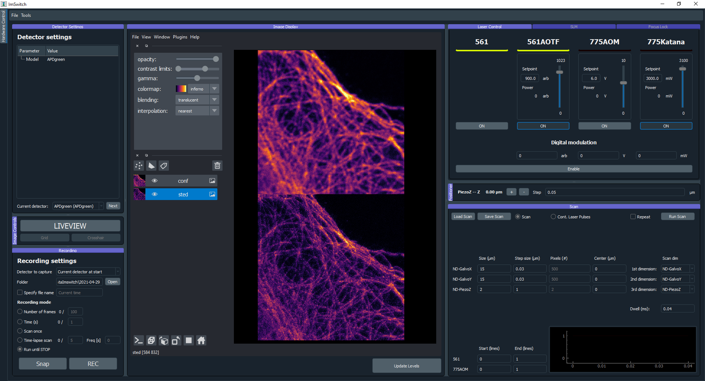

*********
Use cases
*********

The first time the hardware control module is initialized,
it will show a dialog to choose the hardware setup to be loaded.
The user can change the setup option during execution in "Tools" -> "Pick hardware setup…" in the hardware control module's menu bar.

Parallelized confocal and RESOLFT (MoNaLISA)
---------------------------------------------
Here we explain how we implemented ImSwitch for `MoNaLISA <https://www.nature.com/articles/s41467-018-05799-w>`_. In the article, you will find more information
about the setup and how the data is reconstructed.

Configuration file and hardware specifications
^^^^^^^^^^^^^^^^^^^^^^^^^^^^^^^^^^^^^^^^^^^^^^^
For this microscope use case, we created the JSON file ``example_monalisa.json``, located at ``/imswitch/_data/user_defaults/imcontrol_setups/example_monalisa.json``

We chose a National Instruments Data Acquisition (NIDAQ) card for managing the synchronization of the devices.

In the JSON file, two cameras are specified for two-color imaging: Green and Red.
Both cameras are Hamamatsu, so they use ``HamamatsuManager``. All the required camera properties are defined there,
like the DAQ digital line for external triggering, readout speed, exposure time, field of view, etc.

There are five lasers in this setup, we use acousto-optic modulators (AOM) connected to the DAQ to control some of them,
and others need the vendor interface as well, in this case Cobolt. The specific manager is defined for each type, ``LantzLaserManager`` or ``NidaqLaserManager``, (see Hardware Control Configuration).

We use a X-Y-Z stage that we control through the DAQ as well, so the axes are defined as positioners using ``NidaqPositionerManager``. The analog lines and conversion factors are specified as well.
The modules that will create the signals for the scan are ``BetaStageScanDesigner`` for the Stage, and ``BetaTTLCycleDesigner`` for the instrument synchronization.

Other config parameters related to scanning, regions of interest (ROI) and a list of widgets to be loaded are added in this file. 

Hardware control module
^^^^^^^^^^^^^^^^^^^^^^^^
This module is useful to control the hardware and screen the sample using widefield or our other patterns. We have provided a more detailed explanation of the 
GUI :doc:`here <gui>`. To record a super-resolution image the user sets the camera to external-trigger mode and inserts the scan pulse scheme.
The scanning module synchronizes the different instruments through the DAQ, and the raw data is displayed in the liveview.

The user can choose to save the raw data either in disk (hdf5) or RAM (or both) using the Recorder widget. 
So, for example, we program our scan and then click "Scan Once" in REC to start our acquisition. 
The metadata is also saved in the hdf5 and can be reloaded from the toolbar.
It contains all the scanning pulses and hardware parameters related to the experiment.

* GUI while using two-color widefield:

Image processing module for image reconstruction
^^^^^^^^^^^^^^^^^^^^^^^^^^^^^^^^^^^^^^^^^^^^^^^^^^
The raw data can be either manually loaded into the reconstruction module or automatically retreived from the scanning if selected in the Recording widget. The user can further analyze the data using Napari image viewer.
In this module we use our custom-designed DLLs for reconstruction, since this is a rather specific type of algorithm for our method. But the idea is that different microscope techniques implement their own modules as well.
"Multidata management" stacks all the data incomming from the hardware control module.

* The Image processing module is illustrated in the following image:

.. image:: ./images/reconstruction.png
    :width: 600px
    :align: center

Point-scanning confocal and STED 
----------------------------------
Here we explain how we implemented ImSwitch for a `custom-built STED setup <https://doi.org/10.1088/1361-6463/ab4c13>`_ in the lab, previously controlled by a combination of closed-source software (image acquisition) and purpose-built software (hardware control). In the article, you will find more information about the setup, what hardware it contains, and the type of image acquisition we want to perform.

Configuration file and hardware specifications
^^^^^^^^^^^^^^^^^^^^^^^^^^^^^^^^^^^^^^^^^^^^^^^
For this microscope use case, we created the JSON file ``example_sted.json``, located at ``/imswitch/_data/user_defaults/imcontrol_setups/example_sted.json``

We chose a National Instruments Data Acquisition (NIDAQ) card for managing the synchronization of the devices and image acquisition.

In the JSON file, two photon-counting point detectors (APD) are specified for two-color imaging: APDGreen and APDRed.
These do not need any specific hardware control, but instead are read entirely through the Nidaq. 
Additionally two cameras are specified: one for widefield, for having an overview of the sample, and one for the focus lock, as described in detail in the cited article. 
Both cameras are The Imaging Source cameras, so they use ``TISManager``. All the required camera properties are defined, like the camera index in the list of cameras, exposure, gain, brightness, and chip size in pixels.

There are three lasers in this setup, and all three have an associated AOM or AOTF to rapidly control the power, and hence there are six laser devices defined. Two of them controls only fast digital modulation through digital Nidaq lines (561 and 640 lasers); one controls fast digital modulation and analog modulation through digital and analog Nidaq lines (775AOM); one controls the 775 nm laser through RS232 communication and hence has an associated rs232device (775Katana); and the last two controls the power modulation of the multiple channels of the common AOTF for the 561 and 640 nm lasers through RS232 communication with an associated rs232device (561AOTF and 640AOTF). The speicfic manager is defined for each device, ``NidaqLaserManager``, ``AAAOTFLaserManager``, or ``KatanaLaserManager``.

We use galvanometric mirros for the XY-scanning that we control through the DAQ, so the axes are defined as positioners using ``NidaqPositionerManager``. The analog lines of the Nidaq used and conversion factors, for converting µm of the user-input to V for the signal, are specificied as well. Additionally a piezo is used for Z-movement, controlled both through analog signals from the DAQ with a ``NidaqPositionerManager`` and through RS232 communication with a ``PiezoconceptZManager``. 

The modules that will create the signals for the scan are ``GalvoScanDesigner`` for the XY-scanning, and ``PointScanTTLCycleDesigner`` for the laser synchronization. The analog scan designer will create smooth scanning signals with linear acquisition regions for good control of the galvanometric mirrors. The TTL designer will create laser modulation signals that can be controlled on a sub-line level with the widget interface, with automatic turn off during the portions of the scan that are not during acquisition. 

The Hamamtsu SLM used in the setup is managed through the ``SLMManager``, and is simply controlled by connecting it as a monitor and showing a gray-scale image with the pixel values corresponding to the phase-shift you want to impose. The manager is responsible for building this image based on the user-input from the widget. 

The focus lock does not have a separate manager, but instead is associated with one of the TIS cameras and the Z-piezo rs232device. The properties for the focus lock specifies what hardware devices it should associate with, what part of the camera frame should be cropped, and the update frequency (in Hz) of the PI control loop.

The RS232 communication channel protocol parameters necessary for the control of the hardware devices requiring so are also defined in the same file.

Other config parameters and a list of widgets to be loaded are added in this file as well. 

Main module
^^^^^^^^^^^^
The main, and only, module for this use case is used to control all the hardware, screen the sample with widefield, acquiring the images, and inspecting them with the visualization tools. We have provided a more detailed explanation of the GUI :doc:`here <gui>`. To record a confocal image, the user sets the scan parameters that they want for each scan axis (length, pixel size, center position), the pixel dwell time, sets the laser powers they want to use, set the TTL start to 0 and end to 1 (units is lines) for the excitation laser they want to use, and runs the scan. The view of the detectors not in use can be hidden in the visualization tool. The scanning module will build the scanning curves, laser modulation curves, create those tasks in the Nidaq, and start them. The raw data is displayed in the liveview, where the image is updated line-by-line during the acquisition. For recording a STED image the procedure is much the same, with the addition that the use turns on the STED laser in the laser module, and sets the corresponding TTL start and end to the same values, and runs the scan. Before this the SLM has to be configured in order to create a desired depletion pattern, where for using a donut and tophat there are helpful tools in the SLM module to align the mask and the aberration correction that will be specific to each setup.

Previous to any image acquisition, while using either a repeating fast confocal scan or a widefield image, the sample has to be set in focus, and the focus lock can then be used to lock the sample in the focal plane. The focus lock acts independent from the image acquisition and can be continuously turned on for as long as wanted.

The user can choose to save the acquired image to a desired folder and with a desired name by using the Snap button in the recording widget. It will be saved in hdf5 format, and will include all user-defined parameters from the GUI as metadata. Functionality to reload metadata parameters from a previously saved hdf5 file can be found in the toolbar, for easy and precise recreation of a previous experiment. Previously recorded images in tiff format can also be loaded in the visualization module in order to be directly compared with the last recorded image or each other. 

* GUI after having acquired a confocal and a STED image:

CoolLED control through USB and TTLs using a NIDAQ
----------------------------------------------------

.. image:: ./images/coolLED_GUI.png
    :width: 600px
    :align: center

We got a CoolLED (https://www.coolled.com/) in the lab and decided to try ImSwitch out in a setting where we want to control the 8 lasers of the device,
both by doing it manually using the sliders and buttons (using a USB port and RS232 communication protocol), but also being able to design and perform a sequence of TTLs and a X-Y-Z Stage controlled by a National Instruments card. This use case could be combined with the Napari viewer and a camera,
or a point scanning system, or any of the other widgets explained in the other Use Cases.

All the lasers are listed in the JSON file ``example_coolLED.json``, located at ``/imswitch/_data/user_defaults/imcontrol_setups/example_coolLED.json``, by specifying:

* Digital line of each laser in the NIDAQ.
* Wavelength and range (0 to 100).
* Channel name (A-H), each corresponding to the laser.

The ``Positioners`` define the stage axis with the settings, such as:

* Analog channel of the NIDAQ.
* Conversion factors.
* Min and Max voltages.
* Axis (X, Y, or Z).

Then, the ``CoolLEDLaserManager`` will communicate with the ``RS232Manager`` for sending the intensity and on/off commands. The parameters of the ``RS232Manager`` are the typical ones
of a RS232 connection, such as:

* Port (Usually COMx).
* Encoding (ascii).
* Baudrate (57600).
* ByteSize (8)
* Parity (None)
* Stop bits (1)

The pulses will be directly handled by the National Instruments card and our TTLDesigner.

Optical Projection Tomography (OPT) using rotator stepping 
----------------------------------------------------------
contact:

* `David Palecek (CCMAR, Portugal) <mailto:dpalecek@ualg.pt>`_
* `Teresa Correia (CCMAR, Portugal) <mailto:tmcorreia@ualg.pt>`_

.. .. image:: ./images/OPT_GUI.png
..     :width: 600px
..     :align: center

Optical Projection Tomography (OPT) is an optical analogue of a X-ray computer tomography used
in medical imaging. Imswitch implementation aims to provide user-friendly access to end-to-end
pipeline for the OPT, which consist of indispensible steps described below.

Hardware control
^^^^^^^^^^^^^^^^^^^^^^^^

The setup consists of collimated light-source, diffuser, sample mounted on a rotational stage,
in the refractive index matched medium and infinity corrected objective imaging the
2D projections onto the CMOS camera. All elements are aligned on the camera optical axis.

Camera control
~~~~~~~~~~~~~~~~
Camera is software-triggered in the snapping mode. The exposure time is set in the settings
widget on the left. Wait constant is set equal to exposure time in order to avoid blurring of
images for long exposure times, since snad retrieves last frame in the queue, therefore the request
is delayed by the wait time.

Please help us improve and open issues or ask help to implement your own hardware. Or report to us successful
implementations of the hardware you have used to report it here.

Rotational stage control
~~~~~~~~~~~~~~~~~~~~~~~~~~~~
The rotational stage is a stepper motor, which can be 2 phase or 4 phase. The number of steps per revolution
needs to be provided in the json configuration file. The motor is controlled by the `Big Easy Driver <https://www.sparkfun.com/products/12859>`_ and Arduino.
Library used was `telemetrix <https://mryslab.github.io/telemetrix/>`_, which is python interface based on accellStepper library.

Tested HW
~~~~~~~~~~~~~~~~~~~~~~~~~~~~
Cameras:

* `TIS DMK 37BUX252` (USB industrial grade camera, ``TISManager``, ``TIS4Manager``)

Rotational stages:

* `Simple stepper 28BYJ-48` (comes with Arduino UNO, ``TelemetrixRotatorManager``), 2048 steps (not precise, because the gears are TODO). It has a magnetic shaft, which is convenient for sample mounting, however the motor is quite useless for OPT due to the low precision and shaft crookedness.
* `Nanotec ST4118M1804-L <https://en.nanotec.com/products/1271-st4118m1804-a>`_ (4 phase stepper motor, ``TelemetrixRotatorManager``), 3200 steps, good quality, backlash free, but requires a driver, we used Easy driver.

Rotational axis of the sample needs to be as close to perpendicular to the optical axis as possible.
Even though the center of rotation (COR) is always corrected for in the reconstruction, for depth of field
and resolution reasons it is better to have the sample as close to the center of the camera as possible.
Therefor we provide an alignment widget to help with this task.

Alingment widget
^^^^^^^^^^^^^^^^^^^^^^^^

.. .. image:: ./images/alignment_GUI.png
..     :width: 600px
..     :align: center

Rotational axis of the sample needs to be perpendicular to the optical axis and aligned as close to
the center column of the camera as possible. The alignment procedure allows to acquire 2 projections
at 0 and 180 degrees, which for mirror images to each other. Flipping one of them and merging them, if
the mirror axis is exactly at the center column, the merged image will show a single step function and
single cross-sectional profile matching exactly the one which is acquired at 0 degrees.

The widget shows the overlays and matching via whole image, camera horizontal lines cuts
and crosscorrelation function.

The x-shift allows to shift the image in the horizontal direction, which is useful for getting an idea
how far from the center you currently are. x-shift is in pixels so once you find the best overlay, 
you are `x-shift * pixel_size` away from the vertical axis of the chip.

First align the shaft in respect to the camera field of view without the sample:

#. Align the motor shaft that it spans the whole camera vertical field of view.
#. Follow the procedure above to get it centered.
#. Select rows close to the bottom and top of your camera field of view.
#. Plot the slices, if they are shifted in respect to each other, and you see double step function in one of them, your motor shaft is tilted sideways.
#. Adjust the motor shaft tilt until the slices are perfectly aligned. For that we have the motor mounted on `Kinematic Platform Base <https://www.thorlabs.com/thorproduct.cfm?partnumber=KM200B/M>`_.

#. You can approximately check the tilt along the optical axis. Attach a `rigid flange <https://www.amazon.com/Rigid-Flange-Coupling-Coupler-Connector/dp/B06Y6MSYCS?th=1>`_ to the motor shaft.
#. Adjust the height of the flange so that the top edge is close to the central line of the camera.
#. Change focusing to the front and back edge of the flange.
#. If the shaft is tilted away from the camera, the flange ruther from the camera will be clearly visible in the image.
#. On the other hand, if the shaft is tilted towards the camera, the far away flange will never be visible.
#. Adjust the tilt, that the close and far edge of the flange are align in height, and perfectly shadowing each other.

Now the motor is perfectly align, however after mounting the sample, the sample needs to be
centered in respect to the shaft and the camera chip. 

* Example
    
    Consider motor shaft being imaged on the camera. If rotational axis of the shaft is not
    at the center column pixel, the merged overlay of projection at 0 degrees and mirrored projection
    at 180 degrees will show a double step function instead of single step from background light to
    dark shaft shadow.

    Tilt of the shaft is visible as two horizontal
    cuts through the camera row 100 (red) and row 1600 (blue), which need to match perfectly

OPT acquisition
^^^^^^^^^^^^^^^^^^^^^^^^

Corrections
~~~~~~~~~~~~~~~~~~~~~~~~~~~~

Demo experiment
^^^^^^^^^^^^^^^^^^^^^^^^

Even without a hardware, OPT widget allows to simulate and experiment on the Shepp-Logan
phantom.

Napari OPT preprocessing module
^^^^^^^^^^^^^^^^^^^^^^^^^^^^^^^^^^^^^^^^^^^^^^^^
Download  `OPT preprocessing`  napari pluging from. This allows you to preprocess the OPT data
before final reconstruction step. So far it provides following functionalities which are documented
in the plugin documentation:

* ROI selection
* Binning
* Hot pixel correction
* Dark-field correction
* Bright-field correction
* -log transformation (for tranmission or visualization purposes)

In case you `did not` select ``noRam`` acquisition, the plugin is designed to process the 
acquired OPT stack with the corrections which are either in separate layers, or cna be loaded separately.

Napari deep learning reconstruction
^^^^^^^^^^^^^^^^^^^^^^^^^^^^^^^^^^^^^^^^^^^^^^^^

For the reconstruction of the OPT data, we provide a deep learning reconstruction plugin for Napari, which
includes also standard Filter Back Projection (FBP) reconstruction. The plugin is available at
`napari-hub <https://www.napari-hub.org/plugins/napari-tomodl>`_. The plugin preprocessing steps
partially overlap

* COR axis alignment
* Volume reshaping (binning)
* Removing circular edge from the acquisition
* filtering
* Reconstruction method (with and without GPU support)

