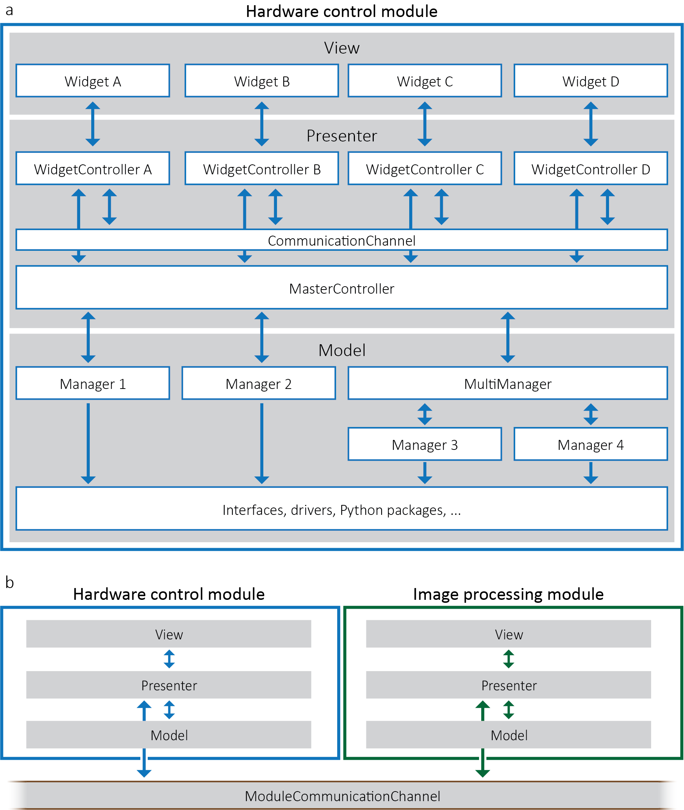

# Summary
The constant development of novel microscopy methods with an increased number of dedicated hardware devices poses significant challenges to software development. On the one hand, software should control complex instruments, provide flexibility to adapt between different microscope modalities, and be open and resilient to modification and extension by users and developers. On the other hand, the community needs software that can satisfy the requirements of the users, such as a user-friendly interface and robustness of the code. In this context, we present ImSwitch, based on the model-view-presenter (MVP) design pattern [@mvp], with an architecture that uses polymorphism to provide a generalized solution to microscope control. Consequently, ImSwitch makes it possible to adapt between different modalities and aims at satisfying the needs of both users and developers. We have also included a scripting module for microscope automation applications and a structure to efficiently share data between different modules, such as hardware control and image processing. Currently, ImSwitch provides support for light microscopy techniques but could be extended to other microscopy modalities requiring multiple hardware synchronization.

# Statement of need
As described in @janelia, there is a need to have a generalized solution for microscope control, since the usual approach in microscopy labs is to create their own custom-built software. A complete list is available in @zenodo_janelia. ImSwitch is designed to be compatible with many different microscope modalities and customizable to the specific design of individual custom-built microscopes, all while using the same code. We would like to involve the community in further developing ImSwitch in this direction, believing that it is possible to integrate current state-of-the-art solutions into one unified software. 

# Architecture and implementation
ImSwitch consists of software modules, e.g., hardware control and image processing, that exchange data through the ModuleCommunicationChannel (\autoref{fig:diagram}). Modules can also expose an internal Application Programming Interface (API) to the scripting platform, allowing user-defined scripts to interact with them without requiring the user to modify the code itself to meet their demands. Each of the modules follows the MVP architecture, which has three primary layers: model, view, and presenter. The hardware control module has the following structure:

* The **model** layer represents the backend of the program. It has direct access to the hardware through a device sub-layer, which contains the interfaces of the devices, drivers, and Python packages. To provide polymorphism, we have added another sub-layer in the model that consists of what we name managers and multi-managers. The managers are objects that will specify how to control the devices, and which packages should be used. For example, a microscope setup with two cameras and three point detectors will make use of a multi-manager called `DetectorsManager`, which in turn will manage two instances of `CameraManager` and three instances of `PointDetectorManager`. Both managers implement the same functionality through identical function calls but with different implementations.

* The **view** layer is the Graphical User Interface (GUI). The GUI for each component of the hardware control module is represented by a view element called a `Widget`. The view layer is linked to the presenter layer by linking each `Widget` with a `WidgetController`. The presenters (`WidgetControllers`) manipulate the views (`Widgets`) but not vice versa.

* We implemented the **presenter** layer using two sub-layers: the first sub-layer contains `WidgetControllers` that mainly read the input of the user through the view and communicate it to the `MasterController`; the second sub-layer has the `MasterController` that directly interacts with the managers. The `CommunicationChannel` serves as a platform to share demands and information between `WidgetControllers`.

{width=80%}

We use PyQt [@pyqt_docu] for the GUI layout, thread management, and event management; Napari [@napari] for image visualization, which can easily integrate multiple image layers and supports plugins for image processing; and HDF5 [@hdf5] for storing image data and metadata, including all parameters of each experiment and acquisition. The user can readily load metadata from stored files into ImSwitch, allowing experiment acquisition from templates.

Central to the concept of allowing modularity is the use of JSON configuration files to define different microscopes. They contain information about the hardware devices and their connections, and the GUI tools to be loaded.

As a proof of concept ImSwitch has been implemented to control the various microscopes of our lab: point-scanning STED/confocal [@sted] and parallelized RESOLFT/confocal (MoNaLISA) [@monalisa]. These microscopes were previously controlled with a combination of purpose-built software that were microscope-specific or closed-source software. The reader can find more details about the implementations and documentation of ImSwitch at [imswitch.readthedocs.io](https://imswitch.readthedocs.io). We have implemented the image processing module for reconstructing MoNaLISA images using our pre-existing shared library. Other microscope modalities requiring designated reconstruction or processing could implement separate modules, using the ModuleCommunicationChannel to retrieve the data, and readily load them into ImSwitch.

# Comparison to other software
µManager [@uManager] is a free and open-source software for microscope control written in Java and C++, with pervasive driver support to different devices and widely used by microscopists. However, µManager does not adapt fully to complex microscopes that require scanning and triggering or other intricate operations. Moreover, software modification and extension are difficult due to the programming languages and the architecture. [Python bindings](https://pypi.org/project/pymmcore/) were recently made available for [MMCore](https://valelab4.ucsf.edu/~MM/doc/MMCore/html/class_c_m_m_core.html), which is the device control layer of µManager, making it compatible with ImSwitch implementation (through the model device sub-layer). Pycro-Manager [@pycroManager] provides access to µManager from Python and combines it with image processing and multiple applications. However, custom plugins must still be written for the µManager Java layer, making it complicated to use in complex devices without a pre-existing specialized implementation. This limits the user-friendliness for microscope users. 

Microscope [@microscope] is a recent alternative for providing a resilient device layer in Python for controlling microscope devices. It is possible to script microscope experiments and use Cockpit [@cockpit] as a GUI. However, the GUI is still limited to simpler microscopes. The most substantial focus of Microscope is to provide a standard interface to control microscope device types. Therefore, it could be integrated with ImSwitch to work towards software generalization by increasing compatibility and including even more devices.

TANGO Controls [@tango] is a software solution for distributed control systems that provides a communication protocol and an object-oriented architecture for controlling devices of a range of applications. Similar to TANGO Controls, EPICS [@epics] focuses on supporting applications that operate complex devices such as particle accelerators and telescopes. While their design and architecture are conceptually similar to ImSwitch, our focus resides on microscopy applications and, in particular, image-based control systems and related hardware when performing experiments and handling data (image acquisition, reconstruction, and analysis). We also provide general tools for microscope users and builders of custom-made microscopes.

# Acknowledgements
We would like to acknowledge the authors of [Tempesta](https://github.com/TestaLab/Tempesta), a further development of Tormenta [@tormenta], for their contributions to earlier software and inspiration for a user-friendly interface. We are also thankful to Francesca Pennacchietti for testing and providing feedback.

We thank the Swedish Foundation for Strategic Research (SSF) funding FFL15-0031 for supporting the project.

# References
